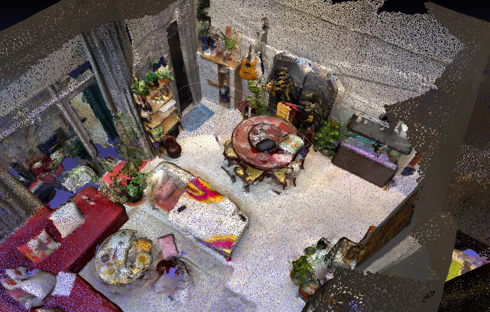

# InteriorCloud: A PointCloud to Floorplan Converter

## Description
This project aims to develop a tool that converts point cloud data into detailed floorplans. Point clouds, often generated through techniques like LiDAR scanning, represent spatial data points in three-dimensional coordinate systems. Our tool seeks to process these data points to create accurate and scalable floorplans, aiding in architectural and construction projects, as well as in interior design and real estate visualization.



## Current Status
As of now, the project is in its initial development stages. We are working on setting up the basic framework and algorithms required to convert the point cloud data into 2D floorplan representations.

## Getting Started
These instructions will get you a copy of the project up and running on your local machine for development and testing purposes. More details will be added as the project evolves.

### Prerequisites
- Python 3.8 or higher
- Libraries: numpy, Open3D, matplotlib (Install using `pip install numpy open3d matplotlib`)

### Installing
To get a development environment running, clone the repository and install the required packages:
```bash
git clone https://github.com/yourusername/pointcloud-to-floorplan.git
cd pointcloud-to-floorplan
pip install -r requirements.txt
